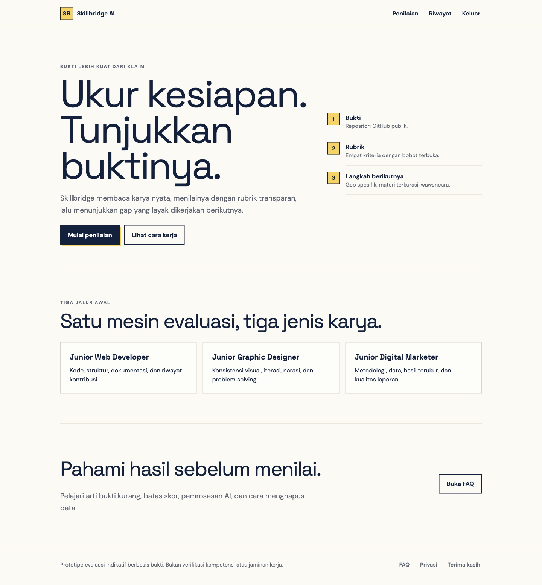
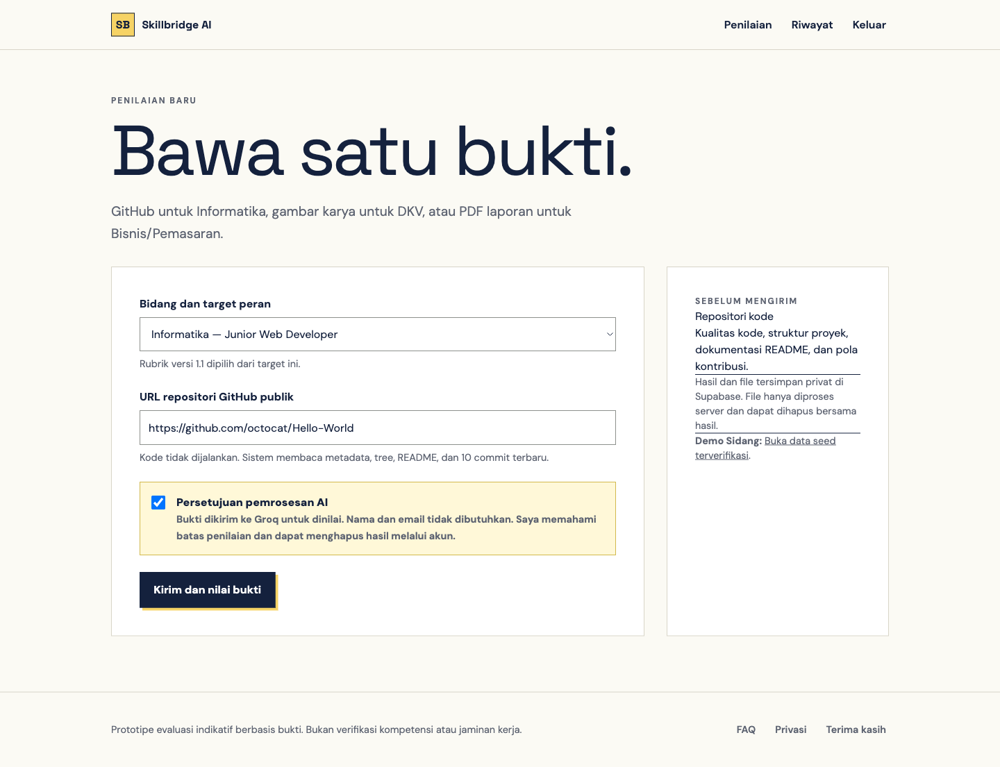
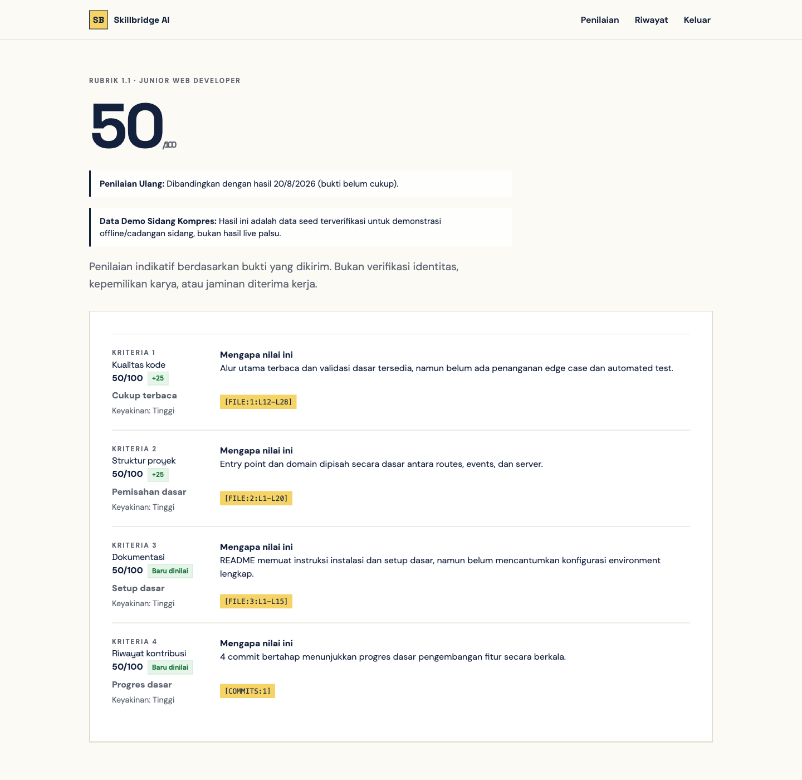
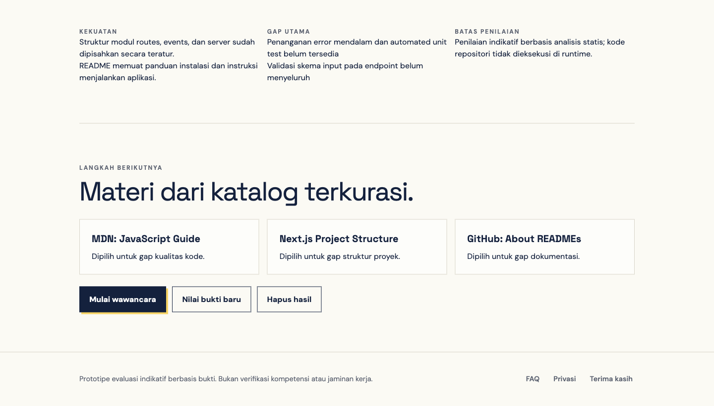
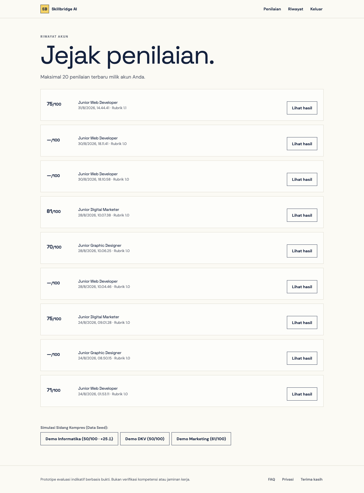
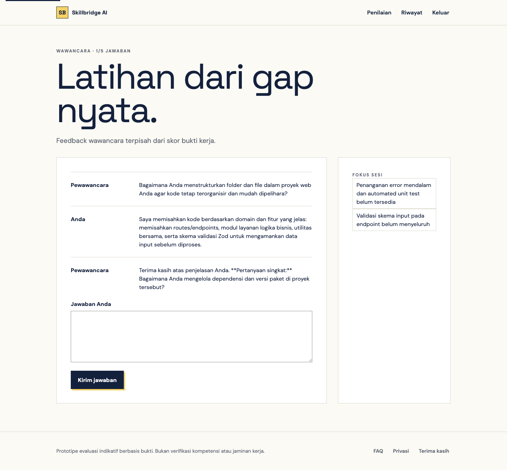

# PANDUAN TATA CARA INSTALASI DAN PENGGUNAAN APLIKASI
## SKILLBRIDGE AI: PLATFORM EVALUASI KESIAPAN KERJA BERBASIS BUKTI DAN REKOMENDASI ADAPTIF MULTI-BIDANG

---

**Informasi Dokumen:**
- **Nama Aplikasi:** Skillbridge AI
- **Versi Rilis:** v1.0.0 (Production & Prototype Release)
- **Tautan Live Deployment:** [https://skillbridge-6ndn.vercel.app](https://skillbridge-6ndn.vercel.app)
- **Repositori Resmi:** [https://github.com/rianszzz/skillbridge](https://github.com/rianszzz/skillbridge)
- **Tanggal Pembaruan:** September 2026
- **Target Pembaca:** Administrator Sistem, Penguji Teknis, Reviewer/Klien, dan Pengguna Akhir (Mahasiswa/Lulusan Baru)

---

## DAFTAR ISI

1. [BAB I. PENDAHULUAN & SPESIFIKASI SISTEM](#bab-i-pendahuluan--spesifikasi-sistem)
   - 1.1 Deskripsi Singkat Skillbridge AI
   - 1.2 Nilai Utama dan Siklus Pembelajaran Tertutup
   - 1.3 Prasyarat dan Kebutuhan Sistem Minimum (Hardware & Software)
   - 1.4 Arsitektur dan Teknologi yang Digunakan
2. [BAB II. PANDUAN INSTALASI & KONFIGURASI SISTEM](#bab-ii-panduan-instalasi--konfigurasi-sistem)
   - 2.1 Jalur Akses Cepat: Melalui Live Cloud Deployment (Tanpa Instalasi)
   - 2.2 Jalur Instalasi Mandiri: Menjalankan Server Lokal (Local Development)
     - 2.2.1 Mengunduh Source Code (Clone Repository)
     - 2.2.2 Menginstal Dependensi Node.js
     - 2.2.3 Konfigurasi Variabel Lingkungan (.env.local)
     - 2.2.4 Setup Database & Storage Supabase (Eksekusi Migrasi SQL 001–005)
     - 2.2.5 Menjalankan dan Memvalidasi Server Lokal
3. [BAB III. PANDUAN PENGGUNAAN APLIKASI LANGKAH DEMI LANGKAH](#bab-iii-panduan-penggunaan-aplikasi-langkah-demi-langkah)
   - 3.1 Registrasi dan Otentikasi Pengguna (Masuk / Buat Akun)
   - 3.2 Menavigasi Beranda dan Memilih Jalur Spesialisasi Karir
   - 3.3 Formulir Pengajuan Penilaian Portofolio Lintas 3 Bidang
     - 3.3.1 Bidang Informatika (Repositori GitHub Publik)
     - 3.3.2 Bidang Desain Komunikasi Visual / DKV (Karya Gambar & Deskripsi)
     - 3.3.3 Bidang Bisnis & Pemasaran (Dokumen Laporan PDF)
   - 3.4 Menyetujui Kebijakan Etika dan Pemrosesan AI (Consent Gate)
   - 3.5 Memahami Laporan Hasil Penilaian Berbobot (Rubrik 1.1 & Bukti Ter-grounding)
   - 3.6 Mempelajari Rekomendasi Materi Terkurasi Berdasarkan Kesenjangan Skill
   - 3.7 Memantau Riwayat Penilaian dan Selisih Peningkatan (*Reassessment Diff*)
   - 3.8 Melakukan Simulasi Wawancara Adaptif Terintegrasi
4. [BAB IV. FITUR PENGUJIAN INSTAN SIDANG (DEMO SEEDS FALLBACK)](#bab-iv-fitur-pengujian-instan-sidang-demo-seeds-fallback)
   - 4.1 Tujuan dan Manfaat Fitur Demo Seed
   - 4.2 Daftar Tautan Demo Seed Terverifikasi Lintas Bidang
5. [BAB V. PANDUAN PEMECAHAN MASALAH (TROUBLESHOOTING) & FAQ](#bab-v-panduan-pemecahan-masalah-troubleshooting--faq)
   - 5.1 Penanganan Error HTTP 429 (AI Rate Limit Groq / Kuota Harian)
   - 5.2 Penanganan Kesalahan Validasi File (Format Magic Bytes & Batas 4 MB)
   - 5.3 Masalah Konfirmasi Email Supabase / Safe Links
   - 5.4 Repositori GitHub Tidak Ditemukan atau Format URL Salah
6. [BAB VI. BATASAN SISTEM, KEAMANAN, & DUKUNGAN TEKNIS](#bab-vi-batasan-sistem-keamanan--dukungan-teknis)
   - 6.1 Batasan Fungsional Prototipe
   - 6.2 Jaminan Keamanan dan Privasi Data
   - 6.3 Kontak dan Dukungan Pengembang

---

<div style="page-break-after: always;"></div>

## BAB I. PENDAHULUAN & SPESIFIKASI SISTEM

### 1.1 Deskripsi Singkat Skillbridge AI
**Skillbridge AI** adalah platform inovasi evaluasi kesiapan kerja (*job-readiness assessment*) berbasis bukti portofolio otentik bagi mahasiswa tingkat akhir dan lulusan baru. Berbeda dengan platform konvensional yang hanya melakukan pencocokan kata kunci pada teks CV (resume parsing), Skillbridge AI melakukan analisis substantif terhadap karya nyata di tiga disiplin ilmu utama:
1. **Informatika (Junior Web Developer):** Mengevaluasi repositori kode sumber publik, struktur direktori, kualitas arsitektur, dokumentasi README, dan riwayat commit Git.
2. **Desain Komunikasi Visual / DKV (Junior Graphic Designer):** Mengevaluasi karya visual digital (PNG/JPEG) bersama penjelasan proses kreatif, hierarki visual, konsistensi warna/tipografi, dan pemecahan masalah desain.
3. **Bisnis & Pemasaran Digital (Junior Digital Marketer):** Mengevaluasi dokumen laporan kampanye pemasaran dalam format PDF, metodologi funnel, ketepatan metrik (CTR, CPA, ROAS), dan transparansi batasan data.

### 1.2 Nilai Utama dan Siklus Pembelajaran Tertutup
Sistem dirancang dengan filosofi **siklus pembelajaran tertutup (*closed-loop learning*)**, di mana asesmen tidak berhenti pada perolehan nilai semata, melainkan memandu peningkatan berkelanjutan:
```text
[Bukti Kerja Otentik] 
       ↓ 
[Ekstraksi & Validasi Statis] 
       ↓ 
[Penilaian Rubrik 1.1 Berbobot (Server-Calculated)] 
       ↓ 
[Analisis Kesenjangan (Skill Gaps) & Kurasi Materi Belajar] 
       ↓ 
[Latihan Wawancara Teknis Adaptif Berbasis Gap] 
       ↓ 
[Penyerahan Bukti Baru & Pengukuran Peningkatan (+Δ Diff)]
```

### 1.3 Prasyarat dan Kebutuhan Sistem Minimum

#### A. Kebutuhan Pengguna Akhir (Client Side)
Untuk mengakses dan menggunakan platform Skillbridge AI melalui peramban web:
- **Perangkat:** Komputer desktop, laptop, tablet, atau smartphone (antarmuka responsif penuh).
- **Peramban Web (Browser):** Google Chrome (v100+), Mozilla Firefox (v100+), Microsoft Edge (v100+), Apple Safari (v15+).
- **Koneksi Internet:** Minimal 1 Mbps stabil (untuk transmisi upload bukti dan streaming respon AI).
- **Format Bukti yang Didukung:**
  - Tautan URL Repositori GitHub Publik (format: `https://github.com/pemilik/nama-repo`).
  - Gambar Portofolio DKV: Format PNG atau JPEG, resolusi maksimal 10.000 × 10.000 piksel, ukuran file $\le 4\text{ MB}$.
  - Dokumen Laporan Pemasaran: Format PDF asli (*bukan hasil scan foto*) dengan text layer, maksimal 15 halaman, ukuran file $\le 4\text{ MB}$.

#### B. Kebutuhan Administrator / Developer (Server Side Setup Lokal)
Jika ingin melakukan instalasi mandiri dari kode sumber (*source code*):
- **Sistem Operasi:** macOS, Linux (Ubuntu/Debian/Fedora), atau Windows 10/11 (disarankan memakai WSL2).
- **Runtime Lingkungan:** Node.js versi 20.x LTS atau versi 22.x LTS (disertai `npm` versi 9.x+).
- **Git:** Git CLI versi 2.30+ untuk clone repositori.
- **Akun Layanan Eksternal (Tersedia Paket Gratis / Free Tier):**
  - **Supabase Account:** Untuk penyediaan PostgreSQL database, Supabase Auth, dan private file storage bucket.
  - **Groq Cloud API Key:** Untuk engine inferensi model LLM kecepatan tinggi (`openai/gpt-oss-20b` dan vision model multimodal).

### 1.4 Arsitektur dan Teknologi yang Digunakan
- **Frontend & Fullstack Framework:** Next.js versi 16.3 (App Router, Turbopack, React 19).
- **Bahasa Pemrograman:** TypeScript (Strict Type Safety).
- **Styling UI:** Tailwind CSS (Desain antarmuka bersih, aksesibel, dan minim beban komputasi browser).
- **Backend & Database:** Supabase PostgreSQL dengan Row-Level Security (RLS) dan RPC transaksi kuota.
- **Penyimpanan Berkas Privat:** Supabase Storage Private Bucket (`evidence-private`).
- **Mesin Inferensi AI:** Groq LPU™ Inference Engine (latensi ultra-cepat ~5–8 detik per evaluasi penuh).
- **Hosting Produksi:** Vercel Global Edge Network dengan perlindungan header keamanan HSTS, CSP, dan CORS ketat.

---

<div style="page-break-after: always;"></div>

## BAB II. PANDUAN INSTALASI & KONFIGURASI SISTEM

Penguji atau klien memiliki **dua pilihan** untuk mengevaluasi aplikasi:
1. **Jalur Cepat (Recommended):** Membuka tautan deployment cloud resmi yang sudah online 24/7 di Vercel.
2. **Jalur Lokal (Self-Hosted):** Menginstal dan menjalankan aplikasi pada mesin komputer lokal penguji.

### 2.1 Jalur Akses Cepat: Melalui Live Cloud Deployment
Aplikasi telah terpasang secara utuh pada infrastruktur cloud Vercel produksi:
- **Alamat URL:** [https://skillbridge-6ndn.vercel.app](https://skillbridge-6ndn.vercel.app)
- **Status Endpoint Health Check:** [https://skillbridge-6ndn.vercel.app/api/health](https://skillbridge-6ndn.vercel.app/api/health) (harus menghasilkan `{"status":"ok"}`).

Pada jalur ini, **Anda tidak perlu menginstal apa pun di komputer Anda**. Anda dapat langsung melompat ke [BAB III. PANDUAN PENGGUNAAN APLIKASI](#bab-iii-panduan-penggunaan-aplikasi-langkah-demi-langkah).

---

### 2.2 Jalur Instalasi Mandiri: Menjalankan Server Lokal (Local Development)

Bagi penguji teknis yang ingin meninjau source code dan menjalankan aplikasi secara lokal, ikuti 5 langkah terstruktur berikut:

#### Langkah 1: Mengunduh Source Code (Clone Repository)
Buka aplikasi Terminal (pada macOS/Linux) atau Git Bash (pada Windows), lalu jalankan perintah:
```bash
# 1. Clone repositori dari GitHub
git clone https://github.com/rianszzz/skillbridge.git

# 2. Masuk ke direktori proyek
cd skillbridge
```

#### Langkah 2: Menginstal Dependensi Node.js
Pastikan Node.js v20 atau v22 telah terpasang pada komputer Anda (`node -v`). Pasang seluruh paket dependensi dengan menjalankan:
```bash
npm install
```
*Tunggu hingga proses instalasi selesai. Seluruh pustaka Next.js, React, Supabase SDK, dan utility akan terpasang di folder `node_modules`.*

#### Langkah 3: Konfigurasi Variabel Lingkungan (.env.local)
Duplikasi berkas contoh konfigurasi `.env.example` menjadi `.env.local`:
```bash
cp .env.example .env.local
```
Buka berkas `.env.local` menggunakan text editor (VS Code, Nano, dsb), lalu lengkapi variabel berikut:
```env
# -------------------------------------------------------------
# 1. GROQ CLOUD API (Mesin Evaluasi AI)
# Dapatkan API Key gratis di https://console.groq.com/keys
# -------------------------------------------------------------
GROQ_API_KEY=gsk_your_groq_api_key_here

# -------------------------------------------------------------
# 2. SUPABASE POSTGRESQL & AUTH
# Dapatkan di Supabase Dashboard -> Project Settings -> API
# -------------------------------------------------------------
NEXT_PUBLIC_SUPABASE_URL=https://your-project-id.supabase.co
NEXT_PUBLIC_SUPABASE_ANON_KEY=eyJhbGciOiJIUzI1NiIsInR5cCI6...
SUPABASE_SERVICE_ROLE_KEY=eyJhbGciOiJIUzI1NiIsInR5cCI6...

# -------------------------------------------------------------
# 3. KREDENSIAL OPSIONAL / DEV HELPER
# -------------------------------------------------------------
SUPABASE_URL=https://your-project-id.supabase.co
SUPABASE_ANON_KEY=eyJhbGciOiJIUzI1NiIsInR5cCI6...
```

> **CATATAN PENTING KEAMANAN:**
> - Kunci `GROQ_API_KEY` dan `SUPABASE_SERVICE_ROLE_KEY` adalah rahasia server. **JANGAN** memberi awalan `NEXT_PUBLIC_` agar tidak bocor ke browser client.
> - Kunci `NEXT_PUBLIC_SUPABASE_ANON_KEY` bersifat publik dan aman dibaca di browser untuk manajemen sesi login pengguna.

#### Langkah 4: Setup Database & Storage Supabase (Eksekusi Migrasi SQL)
Masuk ke dashboard proyek Supabase Anda ([https://supabase.com/dashboard](https://supabase.com/dashboard)), lalu buka menu **SQL Editor**. Jalankan skrip migrasi yang terdapat di folder `supabase/migrations/` secara berurutan:

1. **Migrasi Struktur Dasar:** Buka file `supabase/migrations/001_prototype.sql`, salin seluruh isinya, tempel ke SQL Editor Supabase, lalu klik **Run**. *(Membuat tabel `profiles`, `evidence`, `rubrics`, `assessments`, `criterion_scores`, dsb).*
2. **Migrasi Bucket Penyimpanan:** Jalankan file `supabase/migrations/002_evidence_storage.sql`. *(Membuat bucket penyimpanan privat bernama `evidence-private` dengan proteksi RLS).*
3. **Migrasi Hardening & Kuota API:** Jalankan file `supabase/migrations/003_security_hardening.sql`. *(Menerapkan stored procedure pembatasan kuota dan cascade delete).*
4. **Migrasi Persistensi Wawancara:** Jalankan file `supabase/migrations/005_interview_persistence.sql` jika tersedia. *(Mencatat sesi interaksi tanya-jawab wawancara).*

Selanjutnya, tambahkan URL redirect lokal pada dashboard Supabase Anda:
- Masuk ke **Authentication** $\rightarrow$ **URL Configuration** $\rightarrow$ **Redirect URLs**.
- Tambahkan: `http://localhost:3000/auth` dan `http://localhost:3000`.

#### Langkah 5: Menjalankan dan Memvalidasi Server Lokal
Sebelum menjalankan server, Anda dapat memverifikasi kualitas kode dan suite unit test otomatis (33 test) dengan perintah:
```bash
npm run check
```
Jika seluruh pemeriksaan lulus (hijau), jalankan server development:
```bash
npm run dev
```
Buka peramban web dan kunjungi alamat:
```text
http://localhost:3000
```
Server lokal Skillbridge AI kini telah aktif dan siap digunakan secara penuh.

---

<div style="page-break-after: always;"></div>

## BAB III. PANDUAN PENGGUNAAN APLIKASI LANGKAH DEMI LANGKAH

Bagian ini menyajikan panduan pengoperasian fitur bagi pengguna umum maupun penguji sidang komprehensif, dilengkapi ilustrasi tangkapan layar antarmuka nyata.

### 3.1 Registrasi dan Otentikasi Pengguna (Masuk / Buat Akun)
1. Akses halaman awal aplikasi di `https://skillbridge-6ndn.vercel.app` (atau `http://localhost:3000`).
2. Klik tombol **Masuk** atau **Daftar** pada sudut kanan atas bilah navigasi (*navbar*).
3. Masukkan alamat email dan kata sandi Anda:
   - Jika membuat akun baru: Isi form pendaftaran, klik **Daftar**. Sistem akan mengirimkan email konfirmasi (atau langsung mengarahkan Anda ke dasbor jika auto-confirm diaktifkan).
   - Jika sudah memiliki akun: Masukkan kredensial, lalu klik **Masuk**.
4. Setelah berhasil masuk, bilah navigasi akan menampilkan tautan **Penilaian**, **Riwayat**, dan tombol **Keluar**.

---

### 3.2 Menavigasi Beranda dan Memilih Jalur Spesialisasi Karir
Halaman beranda (*Landing Page*) memperkenalkan proposisi nilai dan metodologi evaluasi platform:



*Gambar 1. Tampilan Halaman Beranda Skillbridge AI pada Peramban Desktop.*

**Panduan Elemen Beranda:**
- **Hero Banner:** Menjelaskan visi evaluasi berbasis portofolio otentik (*"Ukur kesiapan. Tunjukkan buktinya"*).
- **Tiga Tahapan Kerja:**
  1. *Bukti:* Unggah karya nyata (kode, desain, laporan).
  2. *Rubrik:* Dapatkan evaluasi objektif 4 kriteria dengan kutipan bukti.
  3. *Langkah Berikutnya:* Dapatkan kurasi modul belajar dan latihan wawancara.
- **Tiga Kartu Jalur Karir:**
  - *Junior Web Developer:* Standar industri rekayasa perangkat lunak modern.
  - *Junior Graphic Designer:* Standar industri komunikasi visual dan desain merek.
  - *Junior Digital Marketer:* Standar industri strategi pertumbuhan dan akuisisi digital.
- Klik tombol **Mulai Evaluasi Portofolio** untuk langsung berpindah ke formulir penilaian.

---

### 3.3 Formulir Penyerahan Bukti Penilaian Lintas 3 Bidang
Akses halaman penilaian melalui menu **Penilaian** (`/assess`).



*Gambar 2. Formulir Penyerahan Bukti Multi-Bidang dan Panel Panduan Kontekstual.*

#### 3.3.1 Bidang Informatika (Repositori GitHub Publik)
1. Pada pilihan bidang, pilih **Informatika (Junior Web Developer)**.
2. Pada kolom input URL, masukkan tautan repositori GitHub publik Anda.
   - *Format yang valid:* `https://github.com/username/repository-name`
   - *Contoh uji:* `https://github.com/octocat/Hello-World` atau repositori proyek Anda.
3. *Catatan Keamanan:* Sistem tidak pernah menjalankan kode Anda (*Zero RCE Execution*). Sistem hanya membaca file konfigurasi dan source code terpilih via REST API untuk penilaian statis.

#### 3.3.2 Bidang Desain Komunikasi Visual / DKV (Karya Gambar & Deskripsi)
1. Pilih opsi bidang **Desain Komunikasi Visual (Junior Graphic Designer)**.
2. Klik tombol upload berkas dan pilih file gambar portofolio (PNG atau JPEG, maksimal 4 MB).
3. Pada kolom deskripsi proses kreatif, tuliskan narasi singkat mencakup:
   - Latar belakang brief dan target audiens desain.
   - Proses iterasi atau eksplorasi konsep.
   - Alasan pemilihan palet warna dan tipografi.

#### 3.3.3 Bidang Bisnis & Pemasaran (Dokumen Laporan PDF)
1. Pilih opsi bidang **Bisnis & Pemasaran (Junior Digital Marketer)**.
2. Klik tombol upload berkas dan pilih dokumen laporan kampanye pemasaran dalam format PDF (maksimal 15 halaman dan ukuran file $\le 4\text{ MB}$).
3. Pastikan PDF memiliki *text layer* yang dapat diblok/disalin (bukan gambar hasil scan foto).

---

### 3.4 Menyetujui Kebijakan Etika dan Pemrosesan AI (Consent Gate)
Untuk menjamin kepatuhan privasi data dan tata kelola kecerdasan buatan (*AI Governance*):
1. Pengguna wajib membaca penjelasan privasi pada panel sebelah kanan formulir.
2. Centang kotak persetujuan (*consent checkbox*):
   > *"Saya menyetujui pemrosesan bukti kerja ini oleh model AI pihak ketiga sesuai ketentuan privasi."*
3. Tombol **Kirim untuk Dinilai** akan aktif setelah kotak persetujuan dicentang.
4. Klik **Kirim untuk Dinilai**. Sistem akan melakukan ekstraksi bukti dan inferensi evaluasi (durasi rata-rata: 5–15 detik).

---

### 3.5 Memahami Laporan Hasil Penilaian Berbobot (Rubrik 1.1 & Bukti Ter-grounding)
Setelah pemrosesan selesai, pengguna akan diarahkan ke halaman hasil (`/results/[id]`):



*Gambar 3. Halaman Hasil Penilaian Lengkap dengan Skor Berbobot dan Grounding Bukti.*

**Penjelasan Komponen Hasil Penilaian:**
1. **Skor Akhir Berbobot (Contoh: 50/100):** Dihitung secara matematis di server menggunakan rumus $\sum (\text{skor kriteria} \times \text{bobot})$. Model AI tidak dapat mengarang skor akhir ini.
2. **Banner Transparansi Data Seed:** Jika menggunakan data demo sidang, banner kuning transparan menegaskan bahwa data tersebut adalah seed validasi cadangan offline, bukan hasil live palsu.
3. **Evaluasi 4 Kriteria Rubrik 1.1:**
   - *Kualitas Kode (Bobot 35%):* Menilai modularitas, konsistensi sintaks, dan penanganan error.
   - *Struktur Proyek (Bobot 25%):* Menilai kerapian struktur direktori dan konfigurasi paket.
   - *Dokumentasi (Bobot 20%):* Menilai kelengkapan petunjuk README dan kejelasan arsitektur.
   - *Riwayat Kontribusi (Bobot 20%):* Menilai keaktifan dan pesan commit Git yang bermakna.
4. **Anchor Diskrit:** Skor per kriteria menggunakan standar diskrit $0, 25, 50, 75, 100$ atau `null` jika bukti belum mencukupi (*insufficient evidence*).
5. **Kutipan Bukti Ter-grounding Fisik:** Setiap penilaian menyertakan penanda fisik yang dapat diaudit, seperti `[FILE:1:L12-L28]` atau `[COMMITS:1]`.
6. **Badge Selisih (*Diff Badge*):** Menampilkan peningkatan relatif terhadap pengujian sebelumnya (misal: `+25` atau `Baru dinilai`).

---

### 3.6 Mempelajari Rekomendasi Materi Terkurasi Berdasarkan Kesenjangan Skill
Tepat di bawah rincian kriteria, sistem menyintesis kesenjangan kompetensi pengguna:



*Gambar 4. Panel Analisis Kekuatan, Gap Kompetensi, dan Rekomendasi Modul Terkurasi.*

1. **Panel Analisis Otomatis:**
   - *Kekuatan:* Menyoroti kelebihan yang berhasil dibuktikan portofolio.
   - *Gap Utama:* Merangkum 1–2 kelemahan paling signifikan yang perlu diperbaiki.
   - *Batasan Penilaian:* Menjelaskan batas audit statis tanpa runtime eksekusi.
2. **Tiga Kartu Materi Terkurasi:**
   - Sistem mengambil maksimal 3 modul rujukan dari 30 katalog terkurasi resmi (`learning-catalog.ts`).
   - Setiap kartu memuat judul modul, deskripsi relevansi, tingkat kesulitan (*Beginner/Intermediate*), dan tautan langsung ke dokumentasi resmi industri (MDN Web Docs, Next.js Docs, GitHub Docs, Google Analytics Academy, Material Design, dsb).
3. **Tombol Navigasi Aksi:**
   - Klik **Mulai wawancara** untuk berlatih menjawab pertanyaan terkait gap Anda.
   - Klik **Nilai bukti baru** untuk mengirimkan perbaikan portofolio Anda.
   - Klik **Hapus hasil** untuk menghapus riwayat penilaian secara permanen (*cascade deletion*).

---

### 3.7 Memantau Riwayat Penilaian dan Selisih Peningkatan (Reassessment Diff)
Pilih menu **Riwayat** (`/history`) untuk meninjau seluruh jejak asesmen yang pernah Anda lakukan:



*Gambar 5. Halaman Riwayat Penilaian dan Launcher Simulasi Re-assessment Diff.*

- Menampilkan daftar kronologis pengujian lengkap dengan tanggal, bidang, target peran, skor berbobot, dan status kelengkapan bukti.
- Kepatuhan prinsip *Safe Null*: Portofolio yang tidak menyertakan bukti minimal diberi status `—/100` (*bukti belum cukup*), bukan nol palsu.
- **Badge Peningkatan (*+25 Δ*):** Menggambarkan kemajuan nyata kandidat setelah merevisi portofolio (misalnya dari revisi awal 25/100 menjadi 50/100).

---

### 3.8 Melakukan Simulasi Wawancara Adaptif Terintegrasi
Klik tombol **Mulai wawancara** pada halaman hasil atau buka halaman `/interview/[id]`:



*Gambar 6. Simulasi Wawancara Adaptif dengan AI Evaluator Berbasis Dialog Multi-Turn.*

**Tata Cara Sesi Wawancara:**
1. Klik tombol **Mulai pertanyaan pertama**. Sistem akan membaca 2 kesenjangan (*skill gaps*) utama portofolio Anda dan menyusun pertanyaan teknis kontekstual.
2. Tuliskan jawaban teknis Anda pada kotak teks **Jawaban Anda** (maksimal 3.000 karakter).
3. Klik tombol **Kirim jawaban**.
4. Pewawancara AI akan menganalisis respon Anda, memberikan kalimat umpan balik konstruktif, lalu mengajukan pertanyaan pendalaman berikutnya.
5. **Indikator Progres:** Melacak jumlah jawaban Anda (misal: *Wawancara · 1/5 jawaban*). Sesi dibatasi maksimal 5 putaran tanya-jawab.
6. **Pemisahan Skor:** Umpan balik wawancara bersifat kualitatif formatif dan terpisah tegas dari nilai bukti kerja fisik portofolio Anda.

---

<div style="page-break-after: always;"></div>

## BAB IV. FITUR PENGUJIAN INSTAN SIDANG (DEMO SEEDS FALLBACK)

### 4.1 Tujuan dan Manfaat Fitur Demo Seed
Untuk keperluan demonstrasi sidang komprehensif atau pengujian cepat oleh klien:
- Kadang kala kuota API pihak ketiga (Groq LPU) mengalami lonjakan atau antrian jaringan kampus sedang lambat.
- Skillbridge AI dilengkapi **4 data seed terverifikasi deterministik** yang mengimplementasikan RFC 4122 UUID v4 (`src/lib/demo-seed.ts`).
- Fitur ini dapat dibuka **langsung tanpa perlu login akun** (*guest-resilient mode*).

### 4.2 Daftar Tautan Demo Seed Terverifikasi Lintas Bidang
Buka tautan berikut pada browser Anda untuk menguji demonstrasi instan:

| Bidang Studi | Target Peran | Keterangan Demonstrasi | Tautan Langsung Halaman Hasil | Tautan Langsung Simulasi Wawancara |
| :--- | :--- | :--- | :--- | :--- |
| **Informatika (Revisi 2)** | Junior Web Developer | Hasil Sedang (**50/100**) dengan badge kenaikan **`+25 Δ`** | [`/results/00000000-0000-4000-8000-000000000002`](https://skillbridge-6ndn.vercel.app/results/00000000-0000-4000-8000-000000000002) | [`/interview/00000000-0000-4000-8000-000000000002`](https://skillbridge-6ndn.vercel.app/interview/00000000-0000-4000-8000-000000000002) |
| **Informatika (Revisi 1)** | Junior Web Developer | Hasil Lemah (**25/100**) sebelum perbaikan dokumentasi | [`/results/00000000-0000-4000-8000-000000000001`](https://skillbridge-6ndn.vercel.app/results/00000000-0000-4000-8000-000000000001) | [`/interview/00000000-0000-4000-8000-000000000001`](https://skillbridge-6ndn.vercel.app/interview/00000000-0000-4000-8000-000000000001) |
| **Desain Visual (DKV)** | Junior Graphic Designer | Hasil Sedang (**50/100**) evaluasi visual & brief desain | [`/results/00000000-0000-4000-8000-000000000022`](https://skillbridge-6ndn.vercel.app/results/00000000-0000-4000-8000-000000000022) | [`/interview/00000000-0000-4000-8000-000000000022`](https://skillbridge-6ndn.vercel.app/interview/00000000-0000-4000-8000-000000000022) |
| **Pemasaran (Marketing)**| Junior Digital Marketer | Hasil Sedang (**61/100**) evaluasi laporan metrik kampanye | [`/results/00000000-0000-4000-8000-000000000032`](https://skillbridge-6ndn.vercel.app/results/00000000-0000-4000-8000-000000000032) | [`/interview/00000000-0000-4000-8000-000000000032`](https://skillbridge-6ndn.vercel.app/interview/00000000-0000-4000-8000-000000000032) |

---

<div style="page-break-after: always;"></div>

## BAB V. PANDUAN PEMECAHAN MASALAH (TROUBLESHOOTING) & FAQ

### 5.1 Penanganan Error HTTP 429 (AI Rate Limit Groq / Kuota Harian)
- **Gejala:** Muncul pesan pop-up merah: *"Layanan AI sedang sibuk. Coba lagi setelah satu menit."* atau *"Batas kuota penilaian tercapai."*
- **Penyebab:**
  1. *Provider Rate Limit:* Batas kecepatan akun Groq free tier (~8.000 token per menit) tercapai karena pengujian serentak.
  2. *Security Quota:* Sistem membatasi maksimal 10 kali penilaian per akun per hari untuk mencegah penyalahgunaan.
- **Solusi:**
  - Tunggu jeda waktu 60 detik (*Retry-After* header).
  - Gunakan **Jalur Demo Seed** pada Bab IV untuk demonstrasi bebas kuota.
  - Untuk instalasi lokal, ganti `GROQ_API_KEY` pada `.env.local` dengan API key baru dari konsol Groq.

### 5.2 Penanganan Kesalahan Validasi File (Format Magic Bytes & Batas 4 MB)
- **Gejala:** Muncul error: *"Format bukti tidak didukung. Gunakan PDF, PNG, atau JPEG sesuai bidang"* atau *"Ukuran bukti harus lebih dari 0 dan maksimal 4 MB."*
- **Penyebab:**
  - Sistem memeriksa **Magic Bytes biner file** (`%PDF` atau `\x89PNG`), bukan hanya ekstensi nama file. File palsu (misal berkas teks yang dinamai `.pdf`) akan ditolak server.
  - Berkas melebihi ukuran 4.194.304 byte.
- **Solusi:**
  - Pastikan dokumen diekspor langsung dari aplikasi resminya (Canva/Photoshop untuk PNG, Microsoft Word/Google Docs untuk PDF).
  - Kompres ukuran file jika melebihi 4 MB sebelum diunggah.

### 5.3 Masalah Konfirmasi Email Supabase / Safe Links
- **Gejala:** Tautan konfirmasi email dianggap kedaluwarsa atau redirect ke `localhost:3000` saat menggunakan Vercel.
- **Penyebab:** URL redirect di dashboard Supabase belum diperbarui dengan domain Vercel.
- **Solusi:**
  - Buka Supabase Dashboard $\rightarrow$ **Authentication** $\rightarrow$ **URL Configuration**.
  - Masukkan domain produksi Anda ke dalam **Site URL** dan **Redirect URLs**:
    - `https://skillbridge-6ndn.vercel.app/auth`
    - `https://*.vercel.app/auth`
  - Klik **Save Changes**.

### 5.4 Repositori GitHub Tidak Ditemukan atau Format URL Salah
- **Gejala:** Error: *"Gunakan URL repositori GitHub publik yang valid."*
- **Penyebab:** Repositori berstatus *Private*, mengarah ke domain selain GitHub, atau format URL memuat path cabang/file (misal: `/tree/main/...`).
- **Solusi:**
  - Pastikan visibilitas repositori diubah menjadi **Public** pada pengaturan GitHub.
  - Gunakan format URL induk murni: `https://github.com/pemilik/nama-repo`.

---

<div style="page-break-after: always;"></div>

## BAB VI. BATASAN SISTEM, KEAMANAN, & DUKUNGAN TEKNIS

### 6.1 Batasan Fungsional Prototipe
1. **Analisis Kode Statis:** Evaluasi Informatika dilakukan secara analisis statis sintaks dan struktur; sistem tidak menjalankan kode atau mengeksekusi *test suite* runtime pengguna.
2. **Kebutuhan Text Layer pada PDF:** Parser laporan Bisnis/Pemasaran memerlukan dokumen digital ber-text layer; dokumen hasil scan gambar/foto saat ini belum didukung (OCR belum aktif).
3. **Sifat Penilaian Indikatif:** Penilaian bersifat diagnostik formatif berdasarkan bukti yang diserahkan dan rubrik acuan Skillbridge AI; hasil bukan sertifikasi kompetensi hukum atau jaminan penerimaan kerja.

### 6.2 Jaminan Keamanan dan Privasi Data
- **Zero-Storage of Untrusted Code:** Kode repositori tidak disimpan permanen di server dan tidak pernah dieksekusi.
- **Private Storage Bucket:** Berkas gambar dan PDF tersimpan di bucket privat Supabase ber-enkripsi yang hanya dapat diakses melalui signed URL milik akun pengunggah.
- **Perlindungan Injeksi Prompt:** Teks bukti dibersihkan dari zero-width obfuscation dan filter adversarial instruksi model.
- **Hak Penghapusan Penuh:** Pengguna berhak menghapus data penilaian kapan saja melalui tombol *Hapus Hasil*, yang akan memicu penghapusan menyeluruh (*cascade delete*) di database dan penyimpanan fisik.

### 6.3 Kontak dan Dukungan Pengembang
Jika Anda mengalami kendala teknis atau memiliki pertanyaan lebih lanjut seputar platform Skillbridge AI, silakan hubungi tim pengembang:
- **Pengembang:** Tim Mahasiswa Informatika & Pengembang Skillbridge AI
- **Institusi:** Universitas Gunadarma — Laboratorium Informatika (Proposal Kompres 16)
- **Tautan Repositori Proyek:** [https://github.com/rianszzz/skillbridge](https://github.com/rianszzz/skillbridge)
- **Tautan Live Platform:** [https://skillbridge-6ndn.vercel.app](https://skillbridge-6ndn.vercel.app)

---
*Dokumen Buku Panduan Resmi Skillbridge AI — Versi Cetak Standar Industri 2026.*
