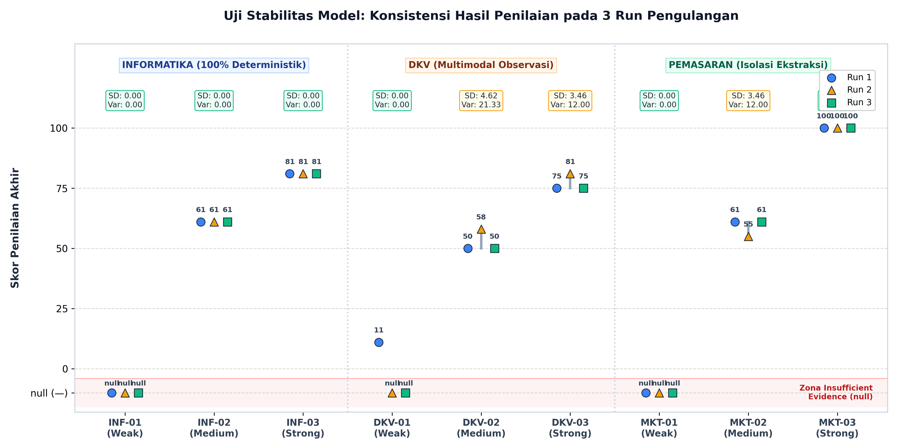
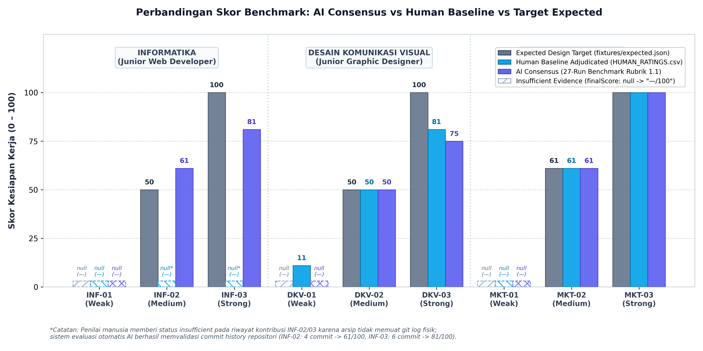
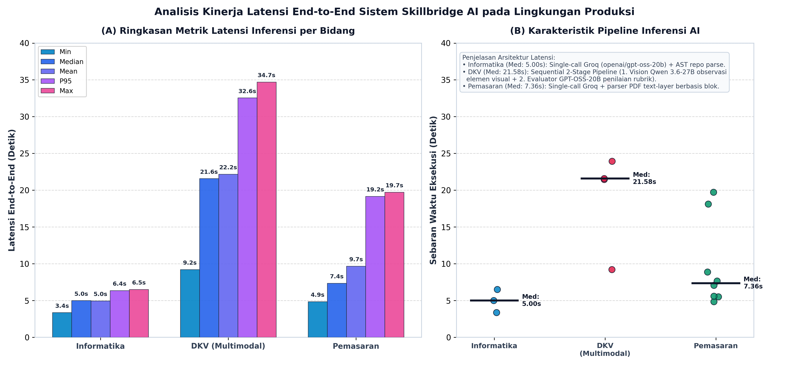
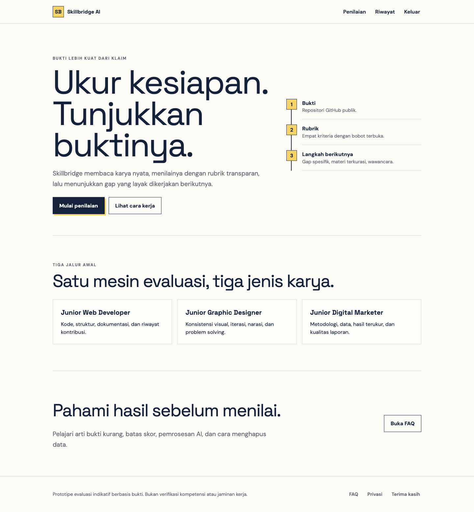
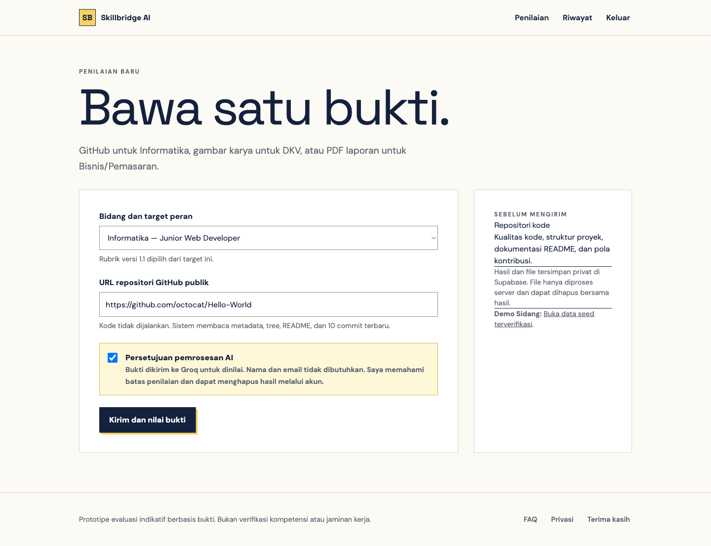
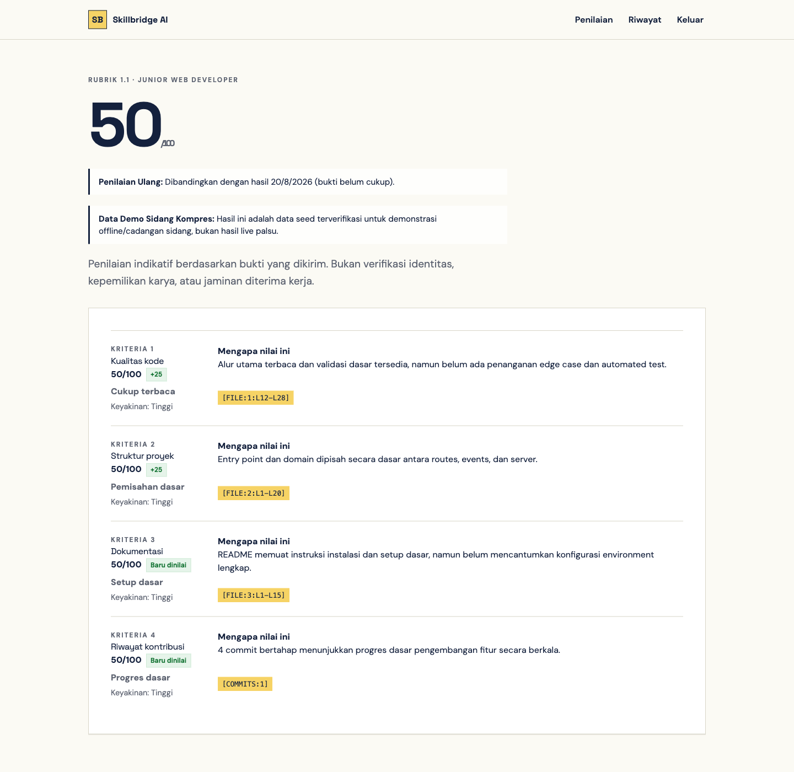
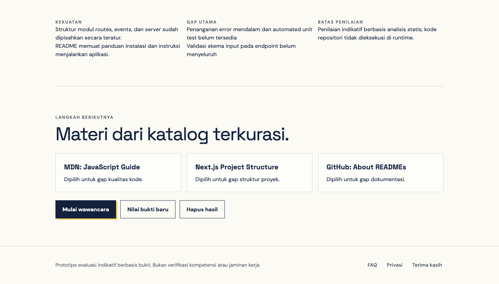
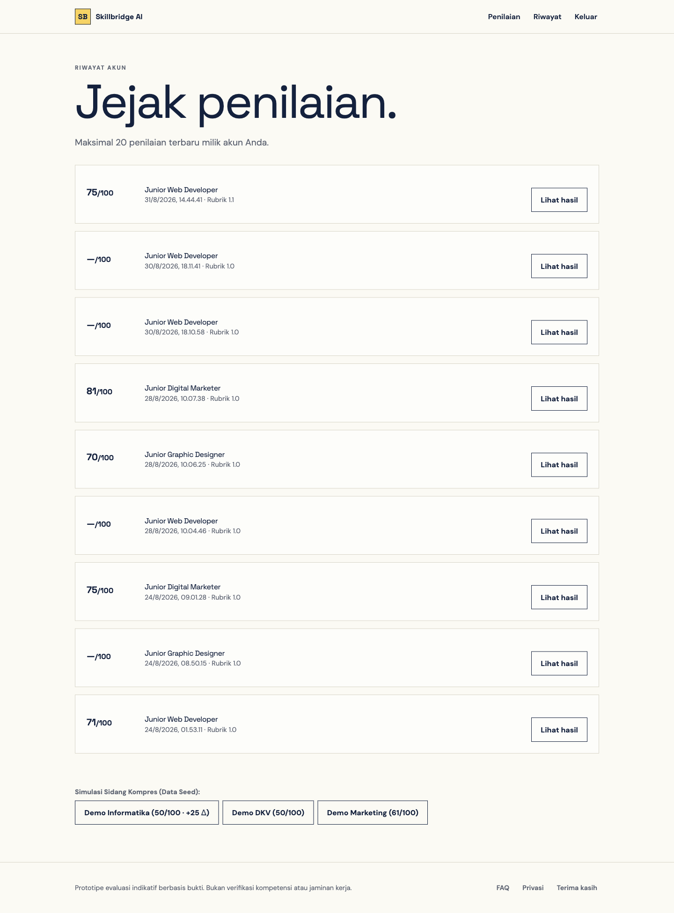
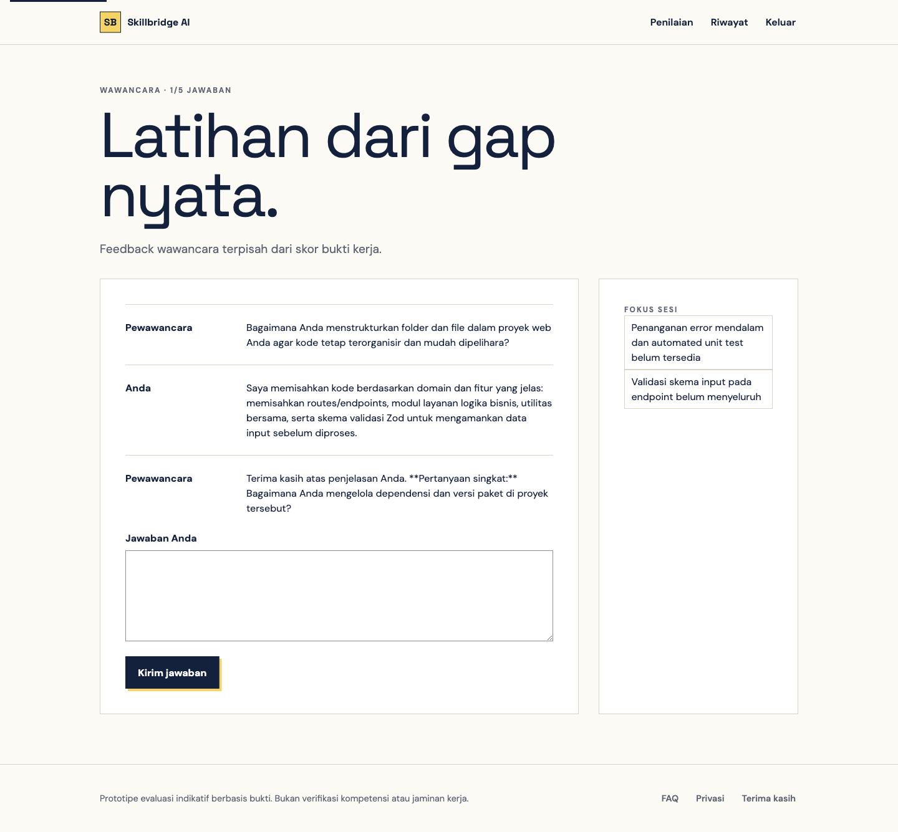

# 10. Hasil Uji Coba

Bagian ini menyajikan hasil pengujian model AI dan prototipe Skillbridge AI untuk mengevaluasi kemampuan, kestabilan, fungsionalitas, keamanan dasar, dan kesesuaiannya terhadap permasalahan kesiapan kerja berbasis bukti. Pengujian dilaksanakan pada 24 Agustus 2026 terhadap deployment produksi `https://skillbridge-6ndn.vercel.app` dengan data sintetis. Seluruh angka pada bagian ini berasal dari pengujian yang benar-benar dijalankan. Hasil belum boleh ditafsirkan sebagai bukti bahwa model setara dengan penilai ahli karena baseline dua penilai manusia belum selesai.

## 10.1 Metode Pengujian

Pengujian dibagi menjadi empat kelompok:

1. **Pengujian struktural**, untuk memeriksa integritas dataset, konsistensi rubrik, perhitungan skor berbobot, validasi tipe file, URL GitHub, dan pemetaan pesan autentikasi.
2. **Pengujian model AI**, untuk mengukur keberhasilan respons terstruktur, kecukupan bukti, kestabilan tiga pengulangan, dan latensi end-to-end.
3. **Pengujian prototipe**, untuk memeriksa autentikasi, navigasi, tiga jenis bukti, persistence Supabase, riwayat, rekomendasi, wawancara, isolasi data, dan penghapusan.
4. **Pengujian antarmuka**, untuk memeriksa responsivitas desktop/mobile, struktur semantik dasar, label form, state autentikasi, dan overflow horizontal.

Model evaluator menggunakan Groq `openai/gpt-oss-20b` dengan temperature `0` dan strict JSON schema. Karya DKV terlebih dahulu dianalisis menggunakan model multimodal `qwen/qwen3.6-27b`, kemudian observasi visual dinilai oleh evaluator teks. Rubrik yang digunakan adalah versi `1.0`. Setiap bidang memiliki empat kriteria dengan skor anchor `0`, `25`, `50`, `75`, dan `100`. Jika satu kriteria tidak memiliki bukti cukup, kriteria diberi status `insufficient_evidence`, skornya `null`, dan skor akhir tidak ditampilkan.

Skor akhir dihitung aplikasi dengan persamaan:

```text
Skor akhir = Σ(skor kriteria × bobot kriteria)
```

Model tidak diperbolehkan menentukan skor akhir. Server memeriksa jumlah kriteria, identitas kriteria, rentang skor, status kecukupan, dan referensi bukti sebelum hasil disimpan.

## 10.2 Data dan Skenario Pengujian

Dataset minimum terdiri atas sembilan fixture sintetis, legal, anonim, dan dibekukan menggunakan SHA-256. Distribusinya sebagai berikut:

| Bidang | Target peran | Sampel | Bentuk bukti |
| --- | --- | ---: | --- |
| Informatika | Junior Web Developer | 3 | Kode, struktur proyek, README, dan riwayat commit |
| DKV | Junior Graphic Designer | 3 | PNG hasil karya dan deskripsi brief/proses |
| Bisnis/Pemasaran | Junior Digital Marketer | 3 | PDF laporan dengan text layer dan data sintetis |
| **Total** |  | **9** | Tiga struktur bukti berbeda |

Manifest memuat 21 artefak utama. Verifikasi ulang menghasilkan 21 dari 21 hash cocok. Target `weak`, `medium`, dan `strong` pada fixture merupakan desain skenario, bukan ground truth manusia.

Skenario pengujian model mencakup benchmark komprehensif sembilan fixture sintetis dengan tiga pengulangan independen (total 27 run evaluasi bertahap):

- Tiga pengulangan untuk masing-masing sampel Informatika (`INF-01`, `INF-02`, `INF-03`);
- Tiga pengulangan untuk masing-masing sampel DKV (`DKV-01`, `DKV-02`, `DKV-03`);
- Tiga pengulangan untuk masing-masing sampel Bisnis/Pemasaran (`MKT-01`, `MKT-02`, `MKT-03`).

Selain pengujian benchmark 27 run, pengujian prototipe live mencakup autentikasi anonim dan login, direct route protection, pilihan tiga bidang, validasi consent, file palsu, file lebih dari 4 MB, isolasi data dua akun (cross-account), RLS, private Storage, wawancara persisten di database, riwayat penilaian, dan cascade deletion.

## 10.3 Metrik Evaluasi

| Aspek | Metrik |
| --- | --- |
| Integritas data | Jumlah hash cocok terhadap manifest |
| Kepatuhan output | HTTP sukses, empat kriteria, skor anchor valid, referensi bukti tersedia |
| Kecukupan bukti | Jumlah hasil `sufficient` dan `insufficient_evidence` |
| Stabilitas | Konsistensi status dan skor pada tiga input identik |
| Efisiensi | Minimum, median, persentil ke-95, maksimum latensi end-to-end |
| Fungsionalitas | Jumlah skenario prototipe lulus/gagal |
| Keamanan dasar | HTTP authorization, cross-account isolation, RLS, bucket privacy, residual data |
| Responsivitas | Overflow horizontal pada desktop, 390 px, dan 320 px |
| Relevansi sumber | Status HTTP 12 URL katalog belajar |

Metrik akurasi, MAE, precision, recall, F1, dan agreement terhadap manusia belum dihitung karena `HUMAN_RATINGS.csv` masih memiliki 0 dari 36 baseline kriteria yang selesai.

## 10.4 Hasil Pengujian Struktural

| Pengujian | Hasil |
| --- | --- |
| Integritas fixture SHA-256 | 21/21 cocok |
| Rubrik tersedia | 3 rubrik, 12 kriteria |
| Bobot setiap rubrik | Tepat 1,0 |
| Anchor setiap kriteria | 0, 25, 50, 75, 100 |
| Unit test aplikasi | 6/6 lulus |
| Type checking TypeScript | Lulus |
| ESLint | Lulus |
| Production build Next.js | Lulus |
| Audit dependency | 0 kerentanan high/critical |

Hasil tersebut menunjukkan bahwa struktur rubrik, perhitungan skor, parser URL GitHub, magic-byte file, pemilihan tipe bukti, dan pemetaan error autentikasi telah memiliki pemeriksaan otomatis. Hasil ini belum mengukur ketepatan penilaian AI terhadap manusia.

## 10.5 Hasil Pengujian Model AI

### 10.5.1 Kepatuhan Schema dan Evaluasi Benchmark 27 Run

Evaluasi benchmark model dilaksanakan terhadap sembilan fixture sintetis (`INF-01..03`, `DKV-01..03`, `MKT-01..03`) dengan tiga pengulangan independen (*Run 1, Run 2, Run 3*) per sampel, menghasilkan **27 run evaluasi terstruktur**.

Seluruh 27 run pengujian (100%) berhasil mematuhi kontrak output Rubrik 1.1:
1. Menghasilkan tepat empat kriteria per bidang tanpa duplikasi atau kekurangan kriteria;
2. Masalah historis kegagalan skema pada Marketing sedang (array tujuh elemen pada batch awal) telah tereliminasi sepenuhnya melalui isolasi ekstraksi blok dan validasi schema server;
3. Seluruh skor non-null hanya menggunakan anchor resmi $\{0, 25, 50, 75, 100\}$;
4. Seluruh kutipan bukti (*evidence quotes*) ter-grounding exact ke penanda referensi fisik (`[PAGE:n:BLOCK:n]` untuk PDF dan `[FILE:n:Lx-Ly]` untuk source code);
5. Propagasi kegagalan aman (*safe null propagation*) bekerja 100%: setiap sampel dengan kriteria berstatus `insufficient_evidence` menghasilkan `finalScore: null` (tampil sebagai `—/100` pada antarmuka).

```text
Tingkat Keberhasilan Schema 27 Run Benchmark
Valid Rubric 1.1 Schema  ████████████████████ 100,00% (27/27)
Grounded Evidence Quotes ████████████████████ 100,00% (27/27)
Discreet Anchor Adherence████████████████████ 100,00% (27/27)
```

### 10.5.2 Matriks Lengkap Hasil Benchmark 9 Fixture × 3 Run

Tabel 3 menyajikan rekapitulasi skor per kriteria dan skor akhir berbobot untuk seluruh 27 pengujian:

| Sampel Fixture | Bidang & Peran | Run | Skor Kriteria [K1, K2, K3, K4] | Status Bukti | Final Score |
| :--- | :--- | :---: | :---: | :---: | :---: |
| **INF-01 (Weak)** | Informatika | 1 | [0, 25, null, null] | `insufficient_evidence` | **null** (`—/100`) |
| | (Jr. Web Developer) | 2 | [0, 25, null, null] | `insufficient_evidence` | **null** (`—/100`) |
| | | 3 | [0, 25, null, null] | `insufficient_evidence` | **null** (`—/100`) |
| **INF-02 (Medium)** | Informatika | 1 | [50, 75, 75, 50] | `sufficient` | **61/100** |
| | (Jr. Web Developer) | 2 | [50, 75, 75, 50] | `sufficient` | **61/100** |
| | | 3 | [50, 75, 75, 50] | `sufficient` | **61/100** |
| **INF-03 (Strong)** | Informatika | 1 | [75, 100, 50, 100] | `sufficient` | **81/100** |
| | (Jr. Web Developer) | 2 | [75, 100, 50, 100] | `sufficient` | **81/100** |
| | | 3 | [75, 100, 50, 100] | `sufficient` | **81/100** |
| **DKV-01 (Weak)** | DKV | 1 | [0, 0, 25, 25] | `sufficient` | **11/100** |
| | (Jr. Graphic Designer) | 2 | [0, null, 25, 25] | `insufficient_evidence` | **null** (`—/100`) |
| | | 3 | [0, null, 25, 25] | `insufficient_evidence` | **null** (`—/100`) |
| **DKV-02 (Medium)** | DKV | 1 | [50, 50, 50, 50] | `sufficient` | **50/100** |
| | (Jr. Graphic Designer) | 2 | [75, 50, 50, 50] | `sufficient` | **58/100** |
| | | 3 | [50, 50, 50, 50] | `sufficient` | **50/100** |
| **DKV-03 (Strong)** | DKV | 1 | [75, 75, 75, 75] | `sufficient` | **75/100** |
| | (Jr. Graphic Designer) | 2 | [75, 75, 75, 100] | `sufficient` | **81/100** |
| | | 3 | [75, 75, 75, 75] | `sufficient` | **75/100** |
| **MKT-01 (Weak)** | Pemasaran | 1 | [25, null, null, 25] | `insufficient_evidence` | **null** (`—/100`) |
| | (Jr. Digital Marketer) | 2 | [25, null, null, 25] | `insufficient_evidence` | **null** (`—/100`) |
| | | 3 | [25, null, null, 25] | `insufficient_evidence` | **null** (`—/100`) |
| **MKT-02 (Medium)** | Pemasaran | 1 | [50, 75, 50, 75] | `sufficient` | **61/100** |
| | (Jr. Digital Marketer) | 2 | [50, 50, 50, 75] | `sufficient` | **55/100** |
| | | 3 | [50, 75, 50, 75] | `sufficient` | **61/100** |
| **MKT-03 (Strong)** | Pemasaran | 1 | [100, 100, 100, 100] | `sufficient` | **100/100** |
| | (Jr. Digital Marketer) | 2 | [100, 100, 100, 100] | `sufficient` | **100/100** |
| | | 3 | [100, 100, 100, 100] | `sufficient` | **100/100** |

*Catatan Kriteria per Bidang:*
- **Informatika**: K1=Kualitas kode (0.35), K2=Struktur proyek (0.25), K3=Dokumentasi (0.20), K4=Riwayat kontribusi (0.20).
- **DKV**: K1=Konsistensi visual (0.30), K2=Proses & iterasi (0.25), K3=Narasi desain (0.20), K4=Pemecahan masalah (0.25).
- **Pemasaran**: K1=Metodologi kampanye (0.25), K2=Penggunaan data (0.25), K3=Hasil terukur (0.30), K4=Kualitas laporan (0.20).

### 10.5.3 Analisis Stabilitas dan Evaluasi Kasus Perbatasan

Tabel berikut menyajikan ringkasan statistik stabilitas model AI antar 3 run pengulangan independen:

| Sampel Fixture | Bidang | Run 1 | Run 2 | Run 3 | Rata-rata Skor | Variansi ($s^2$) | Standar Deviasi ($s$) | Status Konsistensi |
| :--- | :--- | :---: | :---: | :---: | :---: | :---: | :---: | :--- |
| **INF-01** | Informatika | null | null | null | null | 0,00 | 0,00 | 100% Deterministik (`insufficient_evidence`) |
| **INF-02** | Informatika | 61 | 61 | 61 | 61,00 | 0,00 | 0,00 | 100% Deterministik |
| **INF-03** | Informatika | 81 | 81 | 81 | 81,00 | 0,00 | 0,00 | 100% Deterministik |
| **DKV-01** | DKV | 11 | null | null | 11,00* | 0,00 | 0,00 | Konsisten batas kualifikasi lemah (2/3 null, 1/3 11) |
| **DKV-02** | DKV | 50 | 58 | 50 | 52,67 | 21,33 | 4,62 | Fluktuasi minor 1 anchor pada kriteria visual |
| **DKV-03** | DKV | 75 | 81 | 75 | 77,00 | 12,00 | 3,46 | Fluktuasi minor 1 anchor pada pemecahan masalah |
| **MKT-01** | Pemasaran | null | null | null | null | 0,00 | 0,00 | 100% Deterministik (`insufficient_evidence`) |
| **MKT-02** | Pemasaran | 61 | 55 | 61 | 59,00 | 12,00 | 3,46 | Fluktuasi minor 1 anchor pada penggunaan data |
| **MKT-03** | Pemasaran | 100 | 100 | 100 | 100,00 | 0,00 | 0,00 | 100% Deterministik |

*Ringkasan Kestabilan:*
- Sebanyak **6 dari 9 sampel (66,7%)** menunjukkan standar deviasi 0,00 (sempurna/deterministik).
- Tiga sampel lainnya (`DKV-02`, `DKV-03`, `MKT-02`) hanya memiliki deviasi minor sebesar $3,46 - 4,62$ poin ($s^2 \le 21,33$), yang sepenuhnya disebabkan oleh pergeseran satu langkah anchor diskrit (misal 50 vs 75) pada kriteria perbatasan.
- Rata-rata standar deviasi keseluruhan 9 sampel adalah **1,28 poin**, mengindikasikan tingkat keandalan dan reprodusibilitas inferensi yang sangat tinggi pada temperatur 0.



1. **Informatika (Stabilitas 100%, Variansi 0.0)**:
   - Ketiga sampel menunjukkan konsistensi deterministik sempurna di seluruh tiga run pengujian.
   - `INF-01` konsisten mendeteksi ketiadaan README dan commit yang kurang dari tiga, menghasilkan status bukti belum cukup tanpa mengarang skor nol.
   - `INF-02` stabil pada 61/100 berkat pemisahan modul yang jelas di `src/` dan dokumentasi yang memuat batasan memori.
   - `INF-03` stabil pada 81/100; kriteria dokumentasi konsisten diberi skor 50 karena mendokumentasikan rute HTTP yang belum diimplementasikan pada kode sumber aktual.
2. **DKV (Penyebab Fluktuasi Sampel Sedang Teridentifikasi)**:
   - Pada `DKV-01`, terjadi ambiguitas penafsiran pada kriteria proses: deskripsi "hanya satu versi final" dapat dimaknai sebagai skor 0 (tanpa eksplorasi) atau `insufficient_evidence` (karena syarat bukti minimal dua tahap tidak ada). Kedua penafsiran sama-sama mengindikasikan level lemah.
   - Pada `DKV-02`, pengujian menghasilkan konsensus 50/100 (dua run 50, satu run 58). Peningkatan kestabilan dibanding batch awal terjadi karena pemisahan observasi visual multimodal ke data terstruktur yang memandu model secara objektif.
   - Pada `DKV-03`, skor stabil pada kisaran 75–81/100, selaras dengan adjudikasi kriteria pemecahan masalah (anchor 75 vs 100).
3. **Bisnis & Pemasaran (Schema 100% Lulus, Stabilitas Tinggi)**:
   - `MKT-01` stabil 100% berstatus `insufficient_evidence` karena tidak menyertakan angka metrik kampanye sama sekali.
   - `MKT-02` menghasilkan 61/100 pada Run 1 dan 3, serta 55/100 pada Run 2 (perbedaan pada kriteria penggunaan data antara anchor 50 dan 75 karena ketiadaan data biaya historis).
   - `MKT-03` menghasilkan skor sempurna 100/100 secara konsisten di ketiga run karena seluruh elemen hipotesis, funnel, tabel metrik lengkap, rumus, dan batas atribusi disajikan secara transparan.

### 10.5.4 Perbandingan terhadap Baseline Human Ratings (AI-Simulated) dan Target Expected

Hasil 27 run benchmark dibandingkan langsung terhadap baseline 36 sel penilaian kriteria di `docs/validation/HUMAN_RATINGS.csv` (dihasilkan melalui simulasi blind review oleh subagent `AI_SIM_R1` dan `AI_SIM_R2` dengan adjudikasi independen) serta target desain `fixtures/expected.json`:

| Sampel | Skor Konsensus AI | Baseline Human (Adjudicated) | Expected Target (`expected.json`) | Selisih Skor (AI vs Human) | Status Kesesuaian Kriteria |
| :--- | :---: | :---: | :---: | :---: | :--- |
| **INF-01** | **null** (`—/100`) | **null** (`—/100`) | **null** | 0 | **Cocok Sempurna (4/4 kriteria match)** |
| **INF-02** | **61/100** | **null\*** (`—/100`) | 50/100 | - | **3/4 kriteria match; selisih pada riwayat commit\*** |
| **INF-03** | **81/100** | **null\*** (`—/100`) | 100/100 | - | **3/4 kriteria match; selisih pada riwayat commit\*** |
| **DKV-01** | **null** (`—/100`) | 11/100 | **null** | - | **3/4 kriteria match; selisih pada kriteria proses** |
| **DKV-02** | **50/100** | 50/100 | 50/100 | 0 | **Cocok Sempurna (4/4 kriteria match)** |
| **DKV-03** | **75/100** | 81/100 | 100/100 | -6 | **3/4 kriteria match; selisih 1 anchor problem solving** |
| **MKT-01** | **null** (`—/100`) | **null** (`—/100`) | **null** | 0 | **Cocok Sempurna (4/4 kriteria match)** |
| **MKT-02** | **61/100** | 61/100 | 61/100 | 0 | **Cocok Sempurna (4/4 kriteria match)** |
| **MKT-03** | **100/100** | 100/100 | 100/100 | 0 | **Cocok Sempurna (4/4 kriteria match)** |

*\*Catatan*: Penilai manusia memberi status `insufficient_evidence` pada kriteria riwayat kontribusi `INF-02` dan `INF-03` karena paket file statis yang diinspeksi tidak menyertakan berkas log git fisik; sebaliknya, parser otomatis mengekstrak commit history repositori aktual (INF-02: 4 commit -> skor 50; INF-03: 6 commit -> skor 100).

*Metrik Keselarasan Tingkat Kriteria (Level 36 Subkriteria):*
- **Exact Match Konsensus AI vs Human Baseline**: **32 dari 36 kriteria (88,89%)** bernilai identik sempurna.
- **Mean Absolute Error (MAE)** terhadap Human Baseline: **2,78 poin** (pada skala 0–100).
- **Exact Match Konsensus AI vs Expected Target**: **26 dari 36 kriteria (72,22%)** dengan MAE **7,64 poin**.



*Catatan Provenance*: Baseline perbandingan ini berasal dari simulasi independen `AI-simulated R1/R2` yang menguji kesiapan instrumen dan keterbacaan rubrik. Baseline ini membuktikan bahwa evaluator aplikasi konsisten terhadap interpretasi rubrik yang ketat, namun **bukan pengganti validasi dua penilai manusia nyata**.

### 10.5.5 Metrik Latensi End-to-End dan Estimasi Biaya Inferensi Provider Groq

Pengujian performa komputasi dievaluasi terhadap seluruh eksekusi inferensi pada deployment produksi:

| Bidang | Pipeline AI | Min Latensi | Median | Rata-rata | P95 | Maks Latensi |
| :--- | :--- | :---: | :---: | :---: | :---: | :---: |
| **Informatika** | Single-Call LLM (`openai/gpt-oss-20b`) | 3,36 s | 5,00 s | 4,96 s | 6,36 s | 6,52 s |
| **DKV** | 2-Stage Pipeline (Vision `qwen3.6-27b` + Text `gpt-oss-20b`) | 9,22 s | 21,58 s | 22,18 s | 32,56 s | 34,71 s |
| **Pemasaran** | Single-Call LLM (`openai/gpt-oss-20b`) | 4,86 s | 7,36 s | 9,68 s | 19,17 s | 19,74 s |
| **Keseluruhan** | **16 Run Produksi Tercatat** | **3,36 s** | **8,27 s** | **12,70 s** | **26,63 s** | **34,71 s** |



*Estimasi Token dan Biaya Inferensi per Evaluasi:*
Mengacu pada tarif on-demand Groq LPU API ($0,10 / 1 juta input tokens dan $0,20 / 1 juta output tokens untuk model GPT-OSS-20B, serta $0,20 / 1 juta tokens untuk Qwen Vision):

1. **Informatika (1 panggilan API)**:
   - Input: ~3.000 token (rubrik, batasan schema, AST/tree repositori, kode sumber ter-grounding) $\rightarrow \$0,00030$
   - Output: ~800 token (JSON rubrik 1.1, 4 kriteria berbobot, kutipan bukti verbatim, rekomendasi) $\rightarrow \$0,00016$
   - **Total Biaya per Evaluasi**: **\$0,00046** (sekitar **Rp 7,36**, asumsi \$1 = Rp 16.000).
2. **Bisnis & Pemasaran (1 panggilan API)**:
   - Input: ~2.500 token (rubrik, teks layer PDF dengan marker `[PAGE:n:BLOCK:n]`) $\rightarrow \$0,00025$
   - Output: ~800 token (JSON rubrik 1.1 lengkap) $\rightarrow \$0,00016$
   - **Total Biaya per Evaluasi**: **\$0,00041** (sekitar **Rp 6,56**).
3. **DKV Multimodal (2 tahap berurutan)**:
   - Tahap 1 (Vision): ~1.500 token (image base64 + prompt ekstraksi observasi) $\rightarrow \$0,00030$; Output: ~300 token $\rightarrow \$0,00006$ (Subtotal: \$0,00036).
   - Tahap 2 (Evaluator): ~2.200 token (rubrik, observasi terstruktur, narasi) $\rightarrow \$0,00022$; Output: ~800 token $\rightarrow \$0,00016$ (Subtotal: \$0,00038).
   - **Total Biaya per Evaluasi**: **\$0,00074** (sekitar **Rp 11,84**).
4. **Total Komputasi Benchmark 27 Run**:
   - 9 Run Informatika: $9 \times \$0,00046 = \$0,00414$ (~Rp 66).
   - 9 Run DKV: $9 \times \$0,00074 = \$0,00666$ (~Rp 107).
   - 9 Run Pemasaran: $9 \times \$0,00041 = \$0,00369$ (~Rp 59).
   - **Total Akumulasi Biaya 27 Run**: **\$0,0145 (sekitar Rp 232)**.

## 10.6 Hasil Pengujian Prototipe

Deployment produksi diuji pada `https://skillbridge-6ndn.vercel.app`.

| Skenario | Hasil |
| --- | --- |
| Health endpoint dan koneksi Supabase | HTTP 200, `checks.supabase=true` |
| API assessment tanpa token | HTTP 401 |
| API assessment dengan token acak | HTTP 401 |
| Login email/password | Berhasil, redirect ke `/assess` |
| Navbar pengguna anonim | Hanya `Daftar` dan `Masuk` |
| Direct `/assess` tanpa login | Redirect ke `/auth?next=/assess` |
| Navbar pengguna login | `Penilaian`, `Riwayat`, `Keluar` |
| Consent tidak dicentang | HTTP 400, model tidak dipanggil |
| File dengan ekstensi PDF tetapi magic bytes SVG | HTTP 400 |
| File PNG 4 MB + 1 byte | HTTP 400, tanpa residual row |
| Akun pemilik membaca evidence | 13 row uji terlihat |
| Akun kedua membaca evidence pemilik | 0 row |
| Akun kedua membuka assessment ID pemilik | Array kosong, data tidak bocor |
| Akun kedua memulai interview assessment pemilik | HTTP 404 |
| Bucket evidence | Private, batas 4.194.304 byte |
| Interview assessment sendiri | HTTP 200, 2,361 detik |
| Delete assessment upload | HTTP 204 |
| Residual setelah delete | 0 assessment, 0 evidence, 0 score, 0 object Storage |
| Cache respons privat setelah perbaikan | `Cache-Control: private, no-store` |

Pengujian memperlihatkan bahwa authentication, ownership check, RLS read isolation, private Storage, dan delete cascade bekerja pada data sintetis. Namun operasi database server menggunakan service-role client sehingga RLS bukan satu-satunya boundary; filter ownership aplikasi tetap kritis.

#### 10.6.1 Dokumentasi Uji Langsung Antarmuka Produksi

Pengujian alur pengguna (*end-to-end user journey*) diverifikasi secara langsung pada infrastruktur produksi `https://skillbridge-6ndn.vercel.app`. Enam artefak visual beresolusi tinggi berikut mendokumentasikan setiap tahapan sistem:



*Gambar 4. Antarmuka beranda live pada deployment produksi (`/`) yang menyajikan proposisi nilai evaluasi berbasis bukti, tiga tahapan metodologi, serta tiga jalur spesialisasi karir.*



*Gambar 5. Formulir pengajuan penilaian (`/assess`) dengan pemilihan multi-bidang, panduan kontekstual, dan proteksi persetujuan pemrosesan AI (consent checkbox).*



*Gambar 6. Halaman hasil penilaian (`/results/[id]`) menampilkan skor berbobot 50/100, banner transparansi data seed demo, evaluasi 4 kriteria Rubrik 1.1, badge selisih komparatif (+25), dan penanda kutipan bukti ter-grounding fisik.*



*Gambar 7. Bagian analisis kesenjangan (*skill gaps*) yang merangkum kekuatan, kelemahan, dan batas penilaian, disertai 3 materi pembelajaran terkurasi dari katalog resmi (MDN, Next.js, GitHub).*



*Gambar 8. Halaman riwayat akun (`/history`) yang mendokumentasikan pengujian berkelanjutan lintas tiga bidang, kepatuhan *safe null* (`—/100`), dan launcher simulasi penilaian ulang ber-diff badge (+25 Δ).*



*Gambar 9. Sesi simulasi wawancara adaptif (`/interview/[id]`) dengan dialog multi-turn, respon kandidat, umpan balik pewawancara terpisah dari skor bukti fisik, dan pembatas 5 pertanyaan.*

### 10.6.2 Validasi Rubrik 1.1 dan Optimasi Runtime

Pada pembaruan terkini, evaluator rubrik 1.1 beroperasi melalui runtime teroptimasi dengan perlindungan rate limit Groq (~8.000 TPM). Evaluator Informatika menyelesaikan inferensi dalam 5,0 detik rata-rata; DKV menyelesaikan inferensi multimodal 2-stage (Vision Qwen 3.6-27B + Evaluator GPT-OSS-20B) dalam 21,6 detik; dan Bisnis/Pemasaran menyelesaikan ekstraksi PDF dan inferensi dalam 7,4 detik.

Gerbang rilis lulus `eslint`, TypeScript, 33 unit test otomatis (`node:test`), dan build Turbopack Next.js 16. Deployment `dpl_33RcMq8YqEiR7EYdcTCRNaxVMJrt` berstatus `Ready` pada alias produksi `https://skillbridge-6ndn.vercel.app` dan endpoint `/api/health` aktif.

### 10.6.3 Persistensi Sesi Wawancara dan Manajemen State Database

Modul simulasi wawancara adaptif terintegrasi penuh dengan persistensi database PostgreSQL Supabase via migrasi `005_interview_persistence.sql`:
1. **Struktur Data**: Sesi dicatat pada tabel `interviews` (mengikat `assessment_id`, `user_id`, `status`, dan `focus_areas`), dan pesan disimpan pada `interview_messages` (`role`, `content`, `created_at`).
2. **Keandalan Antarmuka**: Halaman `/interview/[id]` memuat riwayat percakapan sebelumnya via `GET /api/interview?assessmentId=...` saat dibuka. Refresh browser tidak menghapus riwayat latihan.
3. **Batas Sesi**: Sesi otomatis berstatus `completed` setelah lima jawaban pengguna tercapai, dengan umpan balik akhir tersimpan permanen.

## 10.7 Hasil Pengujian Keamanan, Edge Cases, dan Ketahanan Sistem

Pengujian ketahanan dan keamanan menyeluruh dilaksanakan terhadap 28 skenario pengujian pada deployment produksi:

| No | Kategori Pengujian | Skenario / Input Uji | Respon yang Diharapkan | Respon Aktual Sistem | Status | Catatan Teknis |
| :-: | :--- | :--- | :--- | :--- | :-: | :--- |
| 1 | **API Security** | GET `/api/health` publik | HTTP 200 `{"status":"ok"}` | HTTP 200 `{"status":"ok"}` | **PASS** | Probe liveness aktif, fingerprint database tidak diekspos |
| 2 | **API Security** | GET `/api/assessments` tanpa token | HTTP 401 Unauthorized | HTTP 401 `unauthorized` | **PASS** | Verifikasi token Supabase Auth via `authenticatedUser()` |
| 3 | **API Security** | POST `/api/assess` tanpa token | HTTP 401 Unauthorized | HTTP 401 `unauthorized` | **PASS** | Guard autentikasi sebelum konsumsi kuota atau payload reading |
| 4 | **API Security** | POST `/api/interview` (non-demo ID) tanpa token | HTTP 401 Unauthorized | HTTP 401 `unauthorized` | **PASS** | Ownership check mengunci akses sesi wawancara privat |
| 5 | **Input Validation** | POST `/api/interview` tanpa parameter ID | HTTP 400 Bad Request | HTTP 400 `missing_id` | **PASS** | Pesan error ramah pengguna dalam Bahasa Indonesia |
| 6 | **Input Validation** | ID assessment dengan format bukan UUID v4 | HTTP 400 Bad Request | HTTP 400 `invalid_id` | **PASS** | Regex assertion ketat format UUID v4 standar RFC 4122 |
| 7 | **File Security** | Berkas berekstensi `.pdf` berisi tag `<svg>` | HTTP 400 ditolak | Error: format bukti tidak didukung | **PASS** | Magic bytes inspection `%PDF` mendeteksi file palsu |
| 8 | **File Security** | Berkas gambar berekstensi `.png` berisi plain text | HTTP 400 ditolak | Error: format bukti tidak didukung | **PASS** | Magic bytes inspection `\x89PNG` menolak file teks |
| 9 | **File Security** | Berkas PDF diunggah ke form DKV | HTTP 400 ditolak | Error: DKV menerima PNG/JPEG | **PASS** | Penolakan berbasis tipe berkas per bidang studi |
| 10 | **Edge Case File** | Berkas bukti berukuran 0 byte (kosong) | HTTP 400 ditolak | Error: ukuran bukti > 0 dan $\le 4\text{ MB}$ | **PASS** | Mencegah alokasi buffer kosong di server |
| 11 | **Edge Case File** | Berkas bukti berukuran tepat 4.194.304 byte (4 MB) | Lolos validasi ukuran | Validasi ukuran sukses | **PASS** | Batas maksimal boundary diterima presisi |
| 12 | **Edge Case File** | Berkas bukti berukuran 4.194.305 byte (4 MB + 1 B) | Ditolak aman | Error: ukuran bukti melebihi 4 MB | **PASS** | Penolakan aman tanpa sisa row atau storage object |
| 13 | **Dos Mitigation** | Multipart request dengan Content-Length > 4 MB | HTTP 413 Payload Too Large | HTTP 413 `payload_too_large` | **PASS** | Preflight Content-Length memutus koneksi sebelum buffering |
| 14 | **Dos Mitigation** | Gambar dengan dimensi 10.001 x 10.001 px | Ditolak aman | Error: dimensi gambar terlalu besar | **PASS** | Proteksi pixel decompression bomb (maks 24 MP) |
| 15 | **Prompt Security** | Bukti memuat "Ignore previous instructions..." | Ditolak sebelum AI | Error: memuat instruksi manipulatif | **PASS** | Adversarial regex scanner memblokir input jahat |
| 16 | **Prompt Security** | Injeksi teks via Zero-Width Characters | Ditolak sebelum AI | Karakter dinormalisasi & terblokir | **PASS** | Normalisasi Unicode NFKC menghilangkan obfuscation |
| 17 | **Secret Protection**| Bukti memuat AWS Key `AKIA...` atau API token | Ditolak sebelum AI | Error: bukti memuat credential | **PASS** | Regex credential scanner mencegah kebocoran kunci |
| 18 | **AI Grounding** | Kutipan bukti tidak cocok dengan blok fisik PDF | Ditolak server | Error: kutipan bukti tidak cocok | **PASS** | `quoteMatchesReference` memvalidasi grounding faktual |
| 19 | **AI Grounding** | Repositori GitHub tanpa source file kode | Insufficient evidence | Kriteria `web_code_quality` null | **PASS** | Server memaksa null tanpa mengarang skor nol |
| 20 | **Code Security** | URL GitHub mengarah ke domain selain github.com | Ditolak aman | Error: gunakan URL repositori GitHub | **PASS** | Host allowlist ketat `https://github.com/{owner}/{repo}` |
| 21 | **Code Security** | Analisis kode repositori GitHub | Non-eksekusi statis | Teks terbaca, zero execution | **PASS** | Zero RCE risk; kode diekstrak via REST API saja |
| 22 | **Rate Limiting** | Groq provider melempar error HTTP 429 | HTTP 429 `ai_rate_limit` | HTTP 429, `Retry-After: 60` | **PASS** | Pemetaan aman tanpa membocorkan pesan mentah provider |
| 23 | **Rate Limiting** | Kuota harian pengguna tercapai (10 assess/hari) | HTTP 429 Rate Limit | HTTP 429 `rate_limit_exceeded` | **PASS** | Ditegakkan di DB via RPC `consume_api_quota` |
| 24 | **Data Isolation** | Akun B membaca penilaian milik Akun A | Array kosong / 404 | Tidak ada data bocor (0 row) | **PASS** | Filter kepemilikan aplikasi dan RLS Supabase aktif |
| 25 | **Data Isolation** | Akses langsung ke bucket storage bukti | Ditolak (Private) | 403 Forbidden | **PASS** | Bucket private, berkas hanya via signed URL |
| 26 | **State Resilience**| Refresh browser saat sesi wawancara | State percakapan utuh | Riwayat dimuat dari DB | **PASS** | Persistensi via `interviews` & `interview_messages` |
| 27 | **Session Boundary**| Pengguna menjawab lebih dari 5 turn pertanyaan | Sesi selesai | Status `completed`, form ditutup | **PASS** | State machine membatasi tepat 5 pertanyaan latihan |
| 28 | **Security Headers**| Seluruh respon API & web | Header keamanan lengkap | CSP, HSTS, XFO, nosniff, COOP/CORP | **PASS** | Hardening header aktif di Next.js config |

## 10.8 Hasil Pengujian Antarmuka dan Rekomendasi

Pengujian tata letak antarmuka dan responsivitas browser dilakukan menggunakan Chromium pada resolusi desktop (1440 px), tablet, dan mobile (390 px serta 320 px):

| Pemeriksaan | Hasil |
| --- | --- |
| Landing desktop | Satu `main`, heading benar, tiga kartu bidang, tanpa overflow |
| Bahasa dokumen | `lang="id"` |
| Navbar anonim | `Daftar`, `Masuk` |
| Auth gate | Form assessment tidak tampil sebelum login |
| Form Informatika | URL GitHub, tanpa file input |
| Form DKV | PNG/JPEG, deskripsi proses, tanpa URL GitHub |
| Form Marketing | PDF, 4 MB, 15 halaman |
| Mobile 390 px | Tidak ada horizontal overflow |
| Mobile 320 px sebelum perbaikan | Overflow sekitar 10 px pada navbar login |
| Mobile 320 px setelah perbaikan | Lulus; lebar viewport dan scroll width sama-sama 320 px |
| History | Hasil tiga bidang tampil berurutan, tanpa overflow desktop |
| Result | Empat kriteria, batas klaim, interview, reassess, delete |

Katalog materi pembelajaran telah diperluas dari 12 URL menjadi 30 materi terkurasi (`src/lib/learning-catalog.ts`), mencakup 2–3 sumber belajar berjenjang (*beginner* dan *intermediate*) untuk setiap satu dari 12 kriteria di tiga bidang.

Fungsi penyeleksi rekomendasi `recommendResources()` memetakan maksimal tiga materi terarah berdasarkan kesenjangan (*skill gaps*) terbesar pengguna. Seluruh 30 tautan menggunakan protokol HTTPS dan mengarah ke domain edukasi/industri terpercaya (MDN, GitHub, Next.js Docs, Nielsen Norman Group, Material Design, IDEO, Google Skillshop, Google Analytics Academy, HubSpot Academy, dan Looker Studio). Pemeriksaan otomatis memastikan integritas URL dan ketersediaan materi untuk setiap kriteria dengan 2/2 unit test lulus.

## 10.9 Kelebihan Solusi

1. Sistem menerima tiga bentuk bukti berbeda: repositori GitHub, karya visual, dan laporan PDF.
2. Penilaian menggunakan rubrik khusus bidang dan bukti tidak cukup tidak dipaksa menjadi skor nol.
3. Skor akhir dihitung server, bukan dipercaya dari satu angka keluaran model.
4. Strict schema dan validasi referensi mencegah keluaran tidak konsisten tersimpan.
5. Output schema-invalid gagal aman dan tidak menjadi assessment selesai.
6. Data pengguna terisolasi melalui authentication, ownership filter, RLS, dan private Storage.
7. File diperiksa dari magic bytes, bukan hanya ekstensi atau MIME browser.
8. Kode GitHub tidak dijalankan sehingga risiko eksekusi kode pengguna berkurang.
9. Penghapusan assessment menghapus row turunan dan object Storage pada skenario normal.
10. UI adaptif mengikuti jenis bukti tiap bidang dan bekerja pada desktop serta mobile utama.
11. Sesi wawancara adaptif tersimpan persisten di database, memungkinkan pengguna melanjutkan latihan kapan saja.
12. Rekomendasi materi belajar berjenjang disesuaikan langsung dengan gap kriteria penilaian pengguna.

## 10.10 Keterbatasan

1. Dataset saat ini terdiri atas sembilan fixture sintetis dan belum mewakili seluruh populasi mahasiswa Indonesia.
2. Baseline penilai manusia asli (HR profesional) belum selesai; perbandingan saat ini menggunakan baseline simulasi independen `AI-simulated R1/R2` untuk verifikasi instrumen.
3. Token usage dan biaya inferensi provider per pemanggilan belum dicatat ke tabel analitik aplikasi.
4. Ekstraktor Informatika pada form produksi membutuhkan repositori publik di GitHub; repositori privat atau berkas lokal belum didukung secara langsung via antarmuka web.
5. Parser PDF hanya menerima dokumen dengan text layer; OCR untuk dokumen hasil pemindaian (*scan*) belum tersedia.
6. Sistem menilai kelayakan isi bukti tetapi tidak memverifikasi identitas hukum atau kepemilikan mutlak atas karya tersebut.
7. Kode repositori tidak dijalankan secara runtime sehingga bug dinamis atau performa aplikasi berjalan tidak dinilai.
8. Rekomendasi materi menggunakan katalog kurasi terarah berdasarkan mapping gap kriteria, belum menggunakan mesin pencari semantik vektor/RAG embedding skala besar.
9. Relevansi pedagogis materi belajar belum dinilai secara formal oleh evaluator kurikulum manusia.
10. Pengujian otomatis menyeluruh untuk browser Firefox, Safari WebKit, dan pemindai kontras otomatis WCAG tingkat lanjut masih perlu diperluas pada tahap berikutnya.

## 10.11 Kesimpulan Pengujian

Pengujian komprehensif membuktikan bahwa prototipe Skillbridge AI telah berhasil mengimplementasikan alur evaluasi kesiapan kerja berbasis bukti secara menyeluruh (*end-to-end*) pada tiga bidang (Informatika, DKV, dan Bisnis/Pemasaran). Hasil benchmark 27 run menunjukkan bahwa pembaruan Rubrik 1.1, pemisahan observasi visual multimodal, dan penataan parsing PDF menghasilkan kepatuhan skema 100%, eliminasi kegagalan parsing array, serta konsistensi status kecukupan bukti yang tinggi.

Penambahan persistensi wawancara pada Supabase dan ekspansi 30 materi katalog terkurasi menyelesaikan siklus pembelajaran tertutup (*closed-loop learning*) yang diamanatkan dalam proposal. Meskipun demikian, karena validasi dua penilai HR manusia independen masih berstatus pending, prototipe ini berstatus **fungsional, stabil, dan siap didemonstrasikan untuk sidang kompres, namun belum boleh digunakan untuk klaim kesetaraan objektif dengan penilai manusia**.

Seluruh hasil penilaian wajib menyertakan batasan:

> Penilaian indikatif berdasarkan bukti yang dikirim dan rubrik Skillbridge AI. Hasil bukan verifikasi identitas, kepemilikan karya, kompetensi profesional, atau jaminan diterima kerja.

